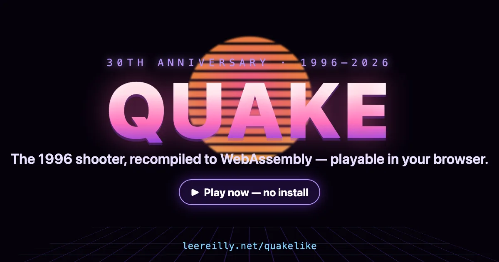

  

# Quakelike

This is id Software's original Quake source code, brought back to life in the
browser. The portable C engine (`WinQuake`) is compiled to WebAssembly with
Emscripten, so the 1996 software renderer runs at full speed on a modern web
page. The GitHub Copilot App helped me hack a few things...

The eight features I'd sell over a fake late-night game radio ad:

- **Quake, in your browser.** The original C
   engine is compiled to WebAssembly and runs on GitHub Pages. Build grabs the
   shareware `pak0.pak`, deploy boots, and you're fragging.
- **Procedural dungeon runs.** Clear a level, jump through the slipgate, and
   get a fresh layout with new walls, textures, monsters, and door logic. Every
   run feels like a new bad neighborhood.
- **Live palette FX.** The renderer stays true to Quake's 8-bit pipeline, then
   remaps colors in real time for Red Hot, Synthwave, and Matrix looks, plus CRT
   scanlines and full ASCII mode synced to the active palette.
- **One-click evidence capture.** Hit Shot for PNG or GIF for a short animated
   clip, encoded right in the browser.
   dependencies.
- **SoundCloud integration.** Flip on a music stream in game while you roam,
   fight, and panic in narrow hallways.
- **Translation support.** UI and messaging can be localized so the same panic
   works in more than one language.
- **Copilot in the console.** Built-in assistant hooks for experiments,
   debugging, and faster iteration while you tune the web port. Press <kbd>`</kbd> to open the Quake console and type `copilot`.

## Play and build

The browser port lives in `web/`. See [`web/README.md`](web/README.md) for the
full story: how the SDL2 platform layer works, how to build with the Emscripten
SDK, how to run it locally over HTTP, the controls, and the GitHub Pages
deploy. The shareware data is downloaded automatically by the Pages workflow;
for a local build you drop your own `pak0.pak` into `web/id1/`.

This repo still contains the complete original sources for winquake, glquake,
quakeworld, and glquakeworld if you want to build the classic desktop versions.

## License

The code is licensed under the GNU General Public License (see `gnu.txt`). The
short version: you can do almost anything you want with the code, including sell
your own version, but if you distribute binaries you have to make the full
source available for free to everyone.

The original Quake data files are still copyrighted under id Software's original
terms, so you cannot redistribute the game data here. If you do a true total
conversion you can ship a standalone game built on this code.

Original engine by John Carmack and id Software. Release grunt work by
Dave "Zoid" Kirsh and Robert Duffy.
